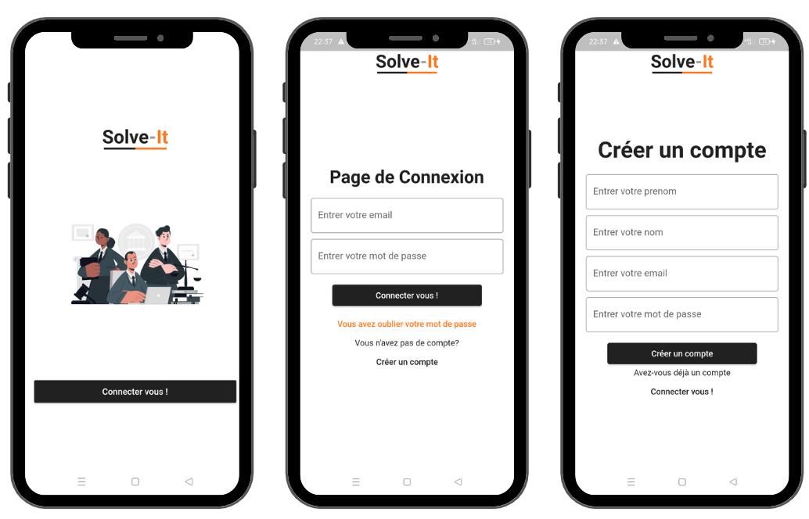
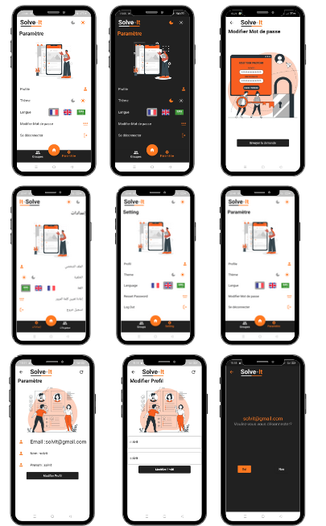
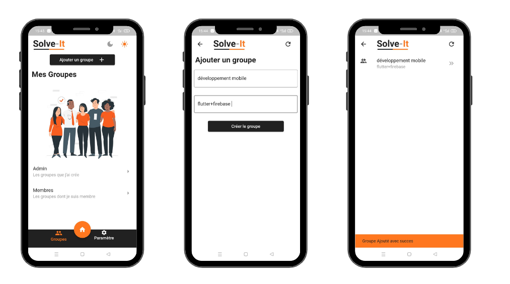
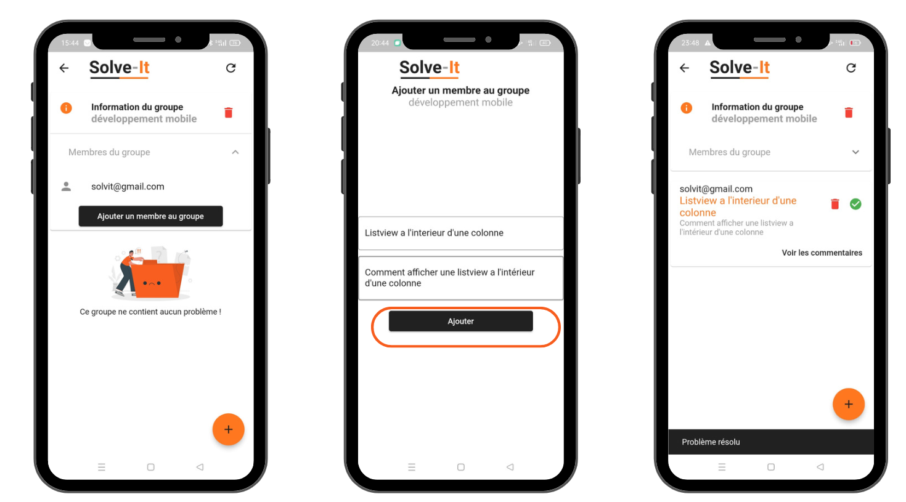

# Application mobile Andoid / IOS

Cette application permet de créer un groupe associé à un projet \
où un utilisateur ajoute les autres membres de l'équipe au groupe.\
Chacun d'eux pourra poster son problème et attendre qu'un autre \
membre commente sa solution.

## Prérequis
Installer [Vs Code](https://code.visualstudio.com/download) \
Installer [Flutter Sdk](https://docs.flutter.dev/get-started/install)

## Outils de programmation

 

## Screenshot
### Authentification

### Paramétrage

### Ajout d'un groupe

### Ajout d'un problème
